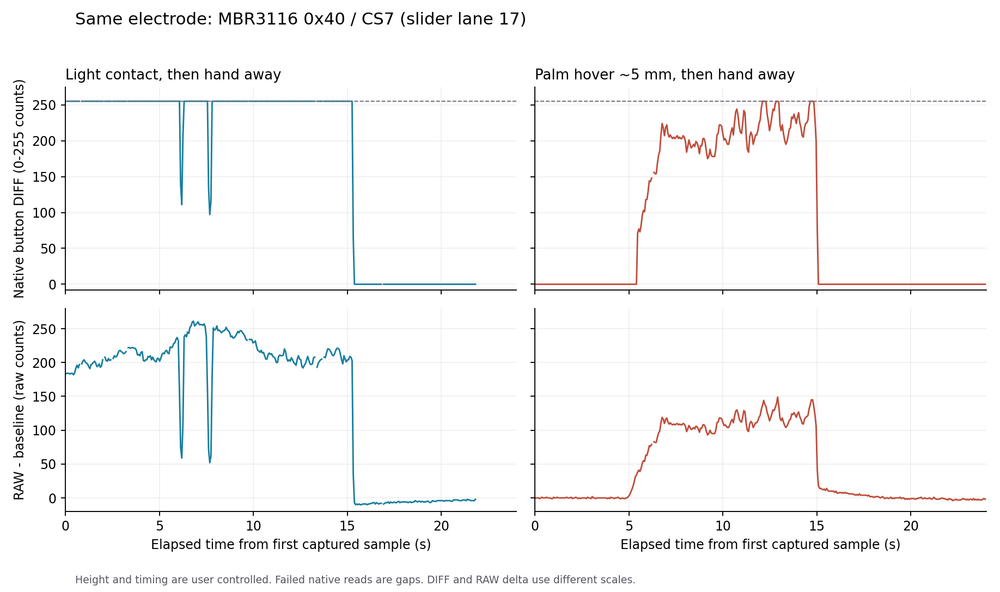

# MBR3116 round89b：实测与固件、寄存器路线

2026-10-01。实机固件为 `1.6.6-beta1 / hw_v1 / round89a`，三颗3116位于0x40、0x41、0x42，32格布局。本文的round89b是实测和面板修正批次，没有新UF2。

用户当前仅接受固件和现有寄存器调整。后续设备在线时可直接刷写；源代码修改须先备份、本地提交，成品注释保持简短。

## 已得到的结论

当前配置下，持续DIFF门可以抑制部分弱信号，但无法仅凭该信号把所有悬空与接触分开。用户确认无接触的手掌接近过程和有效轻触，在同一电极都出现原生DIFF=255。新门开启、ON=179/OFF=127时，悬空手掌仍产生最终触摸输出。

这是当前配置及本轮动作的证据，不代表已经否定全部固件、寄存器方案。高度由用户估计，没有毫米级夹具；不能据此给出精确触发距离或宣称问题已解决。

原厂说明按钮DIFF范围为0–255；其归一化值不等于RAW减基线，超过255的信号会被裁剪。参见[TRM §1.5.104](https://www.infineon.com/assets/row/public/documents/30/57/infineon-cy8cmbr3xxx-capsense-express-controllers-registers-trm-additionaltechnicalinformation-en.pdf)及[Design Guide §6.2.3](https://www.infineon.com/dgdl/Infineon-AN90071_CY8CMBR3xxx_CapSense%28R%29_Design_Guide-ApplicationNotes-v09_00-EN.pdf?fileId=8ac78c8c7cdc391c017d07236b6e4698)。

## 实测摘要

表中格号从1开始。最终输出指C0中的触摸管线结果，未验证游戏内HID手感。

| 阶段 | 数据 | 观察 |
|---|---:|---|
| 新门关闭，手远离 | 487帧 | 32格DIFF与最终输出均零 |
| 新门关闭，全条轻触滑动 | 717帧 | 31格获得有效信号；第31格本次没有命中，不能判定故障 |
| 新门关闭，中央接触/抬手 | 779帧 | 固定点对应第17格，峰值255 |
| 食指约10 mm悬空 | 384帧 | 本次32格均零，不代表其他手姿没有10 mm误触 |
| 食指约5 mm悬空 | 383帧 | 第17格峰值224，105帧有最终输出 |
| 一次静态轻触 | 379帧 | 全零；用户表示接触可能中断，排除出标定 |
| 新门179/127，手掌接近约5 mm并抬离 | 1154帧 | 第15–19格有最终输出，315帧至少一格输出；第15/16/17/19格达到255，用户确认无接触 |
| 新门179/127，轻触并抬离 | 1155帧 | 第17格420帧输出，抬离后全零 |

普通模式通过C5 level 2 + B1读全板DIFF，通过C0读硬件/验证/最终链。两条命令是独立事务，不应把两个包当成同一个芯片扫描。新门关闭时C5压力读数没有独立有效位或新扫描标识；这些帧也不能作为原厂3000个独立RAW噪声样本。

新门轻触阶段还有10帧表现为B1的DIFF=255、C0硬件位ON而最终输出OFF，输出分成9段。独立事务、失败后压力缓存保留、芯片状态变化都可能影响对应关系，尚未定位原因；**不能将本组数据视为连续长按稳定验收通过**。后续先补读取失败遥测并做关联，再继续门限优化。

## 原生RAW与饱和

定位后使用C7读取0x40/CS7，即第17格。C7选择SENSOR_ID并等待40ms，验证调试窗口的同步与ID；它是单电极研究接口，不能直接承担32格高速游戏扫描。

5阶段共1130次请求，1115次成功，15次明确返回`3116 debug fail`，失败样本已排除。原厂SYNC是读一致性校验，不是独立样本编号。

| 观察 | 原生DIFF | RAW−基线 |
|---|---:|---:|
| 空闲 | 全零 | -2至1 |
| 轻触中DIFF已饱和的子集 | 234次为255 | 157至261 |
| 确认无接触的手掌接近子集 | 8次为255 | 137至149 |

RAW在上述饱和子集内保留了强度差异。但不能直接用149与157之间的缺口生成完整接触阈值：轻触过程也有短时低信号，尚无独立接触状态标记；其他区域、手姿及重启后比例没有覆盖。

保持悬空后的另一组数据，基线升到2924附近、DIFF归零；空闲基线约2803。它说明等待就位后才采样会遗漏接近过程。没有记录芯片内部事件，不能将这次基线变化唯一归因于某个滤波或20秒自动复位。后续必须在手远离时先启动记录。

## 仅用固件、寄存器的后续顺序

1. **ATH单变量A/B，优先执行。** 当前三片`DEVICE_CFG2=0x68`，ATH_EN=1；CS0–11手动FT均200，目前不接管自动阈值。先仅对0x40试ATH_EN=0，保留FT、HYS、滤波、灵敏度、引脚和地址。两侧保持同一控制器profile，用全板DIFF及原生BUTTON_STAT比较至少3轮远离→悬空→轻触→抬回悬空，并补慢靠近、快速滑动。失败恢复真实原表；中央通过后才扩展其他芯片。
2. **高门限/滞回联合评估。** 手动FT合法31–200，HYS override合法0–31，原生ON≥FT+H、OFF≤FT−H。它可进一步限制部分候选输入，但在观测信号已经255时不能承诺靠加高门限全部消除。当前有效电极灵敏度已为400 fF档；不写超规格数值或保留寄存器。手动门限、滞回分别做单变量实验，再组合，不能同时改变多个参数后归因。
3. **RAW按需确认，可行性实验。** 先固定一个电极，测原生调试数据切换/锁存时延及重复动作的RAW分离裕量。通过后再评估多指下每片单调试窗口的调度成本。复用SENSOR_ID、DEBUG_SENSOR_ID、SYNC和现有SDK I2C；不把C7的40ms阻塞等待放进普通扫描循环，不把RAW当成DIFF。
4. **时序/空间特征只作有边界的实验。** 上升速度、相邻格形状和持续时间可能改善特定动作；快速悬空、宽掌接触、多指和慢滑动必须作为反例。没有这些证据时，不能把启发式标成接触检测。滤波/去抖还需满足用户可接受的延迟与漏触率。
5. **达到边界时停止无依据调参。** 若同电极的禁止悬空和有效接触仍重叠，或RAW多指延迟破坏游戏手感，则记录现有硬件下的可达范围与妥协。不得用不可达的DIFF>255阈值、关掉有效通道、FSS吞邻键或共用AIR检测来伪装解决32格隔空触发。

ATH实验文件已准备于工作区`_dev_tools/round89_live_20261001/ath_ab_prepared/`，**未写入设备**。它们基于实机128B读回，只修改0x4F的bit3及0x7E/0x7F CRC；CRC复用面板函数并与原厂Host API四位算法交叉校验。首轮仅用0x40，其余文件用于之后的逐片扩展；不是重新生成引脚或保留区配置表。[原厂Host API](https://www.infineon.com/dgdl/Infineon-CY8CMBR3xxx_Host_APIs-ApplicationNotes-v09_00-EN.zip?fileId=8ac78c8c7cdc391c017d0723702846a2)

## 保存、回退与验证

开始时新门已由用户启用：Z=0/F=255/ON=70%/OFF=50%，对应179/127。为测基线只临时清启用位并重算profile check，保留其余配置。原始128B和三片读回表已备份到`_dev_archive/round89_live_before_20261001/`。

真实CFG_SET分命令与128B载荷两次写，CFG_SAVE返回成功；临时关闭后重启回读一致。恢复原配置时验证了配置页15→0回绕、保存后的128B回读和重启回读，0xCE日志为`b4 b8 b7 b5 ce`，无错位风暴。主机脚本最初误把0xCE长度字节当命令标识，已修正；该次保存成功，修正后另行确认回读。

采样结束RAW=0；最终控制器和三颗3116配置与开始备份逐字节一致，普通输入全零。没有执行0xBA、修改3116 NVM或刷写UF2。状态读取另发现ToF #1报告8191及警告，未在本方向顺带更改。

面板`1.1.1-beta8`修正SENSOR_EN高字节说明：三芯片布局使用CS0–11，双芯片使用CS0–15；未改芯片表、协议或保存行为。release产物devDiag=0，SHA-256 `AB27A8EF4C6540F4A99DD546BD8C1316906AFDE9A2F442A069665286561A03F1`。

验证：面板纯函数70/70，Edge/Playwright正式产物Mock 25/25，包括描述渲染、寄存器值保持、保存重连、旧FW与gen2拒绝；无应用异常，测试服务器favicon404与预期gen2拒绝日志单列。Browser插件不可用，使用已安装Playwright；桌面1440×1080，移动端未验。截图在`_dev_tools/round89b_panel_mock/`。

本轮没有固件C/C++或触摸管线变更，免重新ARM构建与迁移测试；不重建相同BID的UF2。游戏内HID/CDC DLL手感、全板有效接触标定、ATH A/B、RAW运行时延迟仍未验证。

证据汇总见[实测JSON](MBR3116_round89b_实测证据_20261001.json)。原始CSV、逐阶段JSON及主机脚本保存在工作区`_dev_tools/round89_live_20261001/`与`_dev_tools/round89_*.py/js`；RAW/DIFF单位及失败处理均可复查。面板修改前备份在`_dev_archive/round89b_before_20261001/`，后续仍仅本地提交、不push。
