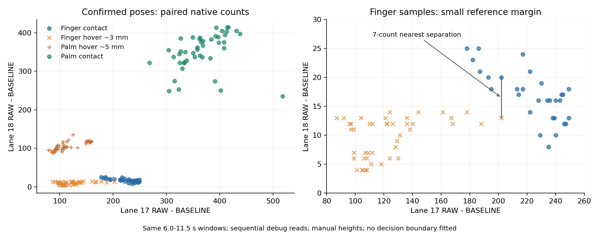

# round89i 相邻RAW与后续实验

2026-10-01，接续[round89h](MBR3116_round89h_同步采样与路线裁决.md)。保留round89g固件及全部配置，复用C7读取第17格0x40:CS7、逻辑相邻第18格0x42:CS0。只选择易失SENSOR_ID，没有编程NVM。两颗芯片依次读取，不是同一时刻；此实验用于静态信息验证，不能代表实时游戏延迟。

## 有哪些新信息

4组确认、1组作废。用户明确澄清仅第一次手掌悬空有偏差，后续悬空及贴面组有效。继续使用固定6.0–11.5秒窗口，163组有效双格数据，失败整对排除。高度由尺子辅助手动估计，没有固定量块。

|姿势|有效对数|中心RAW−BASELINE|参考RAW−BASELINE|参考/中心比例|
|---|---:|---:|---:|---:|
|食指轻触|30|178–249|8–25|0.034–0.140|
|食指悬空3 mm|44|87–202|4–14|0.037–0.149|
|手掌悬空5 mm，重采|44|79–160|88–136|0.732–1.203|
|手掌轻贴|45|268–518|235–414|0.454–1.201|

食指两组的参考DIFF始终为零，参考RAW却有小增量。round89h仅用归一化DIFF观察轮廓遗漏了这部分信息。两维RAW在这些已确认样本中没有完全相同的接触/悬空计数组合；这只是局部线索，不能用无碰撞宣称存在可靠分类边界。

两组单指最近样本为接触`(202,20)`、悬空`(202,13)`，仅参考相差7计数。两组比例高度重叠；手掌比例同样重叠，不能按一个邻格比值换算高度。若中心只保留DIFF、参考仍用RAW增量，则两类又出现相同`(255,12/13/14)`组合，不能把这个简化当作已解决。

参考基线在单指轻触窗口2931→2947、悬空窗口2929→2939，低幅度信号在内部基线更新中被部分吸收。[AN90071 §6.2.3，Noise Threshold](https://assets.infineon.com/is/content/infineon/infineon/row/public/documents/30/42/infineon-an90071-cy8cmbr3xxx-capsenser-design-guide-applicationnotes-en.pdf)描述了低于噪声阈值时基线继续更新的规则；本次趋势与该机制一致，尚未隔离其他漂移来源。

另以每组远离窗口RAW中位数为固定参考，单指接触的邻格增量28–34、悬空16–24，观察间隔仅4计数。固定参考后的比例仍重叠：接触0.117–0.175、悬空0.113–0.193。此计算保留弱信号，可供后续验证；不意味着已可区分不同面积、指尖偏移、慢接近、长按或启动漂移。

## 下一步实验及部署条件

1. **先验证小裕量是否重复。** 固定第17格，记录同一位置短接触/远离、3/5 mm悬空及姿势偏移的完整历史，比较内部基线与远离固定参考。用户目前只有尺子，仍按近似高度记载，不承诺毫米精度。可用裕量须覆盖空闲噪声、启动及位置变化；不能从此次4或7计数直接取门限。
2. **若弱参考被吸收，局部原生Proximity A/B。** 原厂[TRM §1.5.30/35](https://www.infineon.com/assets/row/public/documents/30/57/infineon-cy8cmbr3xxx-capsense-express-controllers-registers-trm-additionaltechnicalinformation-en.pdf)定义0x26 bit0可将0x42:CS0配置为Proximity，0x2E bits2:0中4表示12位、0表示16位。只基于实机原表及原厂CRC修改这些明确定义的字段，保留完整恢复文件。先低分辨率诊断，测幅度/噪声；必要时再单变量提高分辨率，同时记录刷新变化。噪声阈值是否需要接管，须以信号及噪声证据决定，不能预设任意“吸收悬空”规则。[离线实验规格](MBR3116_round89i_Proximity实验规格.json)已核对原表CRC、启用位、合法分辨率及原512门限；仅记录字段差异，没有输出替换配置表或写入设备，芯片接收与效果待实测。
3. **原生参考只覆盖有限输入。** 三片CS0/CS1对应2/4/18/20/29/31格。可以研究作为区域辅助参考，不把六个位置当作完整32格距离测量；实际电极几何及其他区域也需验证。现有按钮管线限定0–255，实验模式不能直接交给正常游戏。
4. **实时读取是独立关卡。** [原厂Host API](https://www.infineon.com/dgdl/Infineon-CY8CMBR3xxx_Host_APIs-ApplicationNotes-v09_00-EN.zip?fileId=8ac78c8c7cdc391c017d0723702846a2)规定改SENSOR_ID后等待刷新间隔。固定调试选择可避免反复换ID，但每片只能提供一个选定电极，不能借此宣称全板RAW快速可读。原生Proximity宽DIFF是否能复用现有全片读取，需要配套正确量程和有效性；更高分辨率的扫描代价须实测，C7等待不能加入游戏路径。
5. **在新信息和时序都通过前保持成品稳定。** 不部署从少量姿势拟合的面积分类、固定比例或加权门限。后续任何源代码改动先备份源码/UF2并本地提交，新增原生模式须匹配原厂映射、协议唯一源和现有恢复路径；涉及持久化/双核/USB按工作区要求独立复核。

## 恢复与证据

退出诊断并普通重启，控制器及三颗3116配置与round89h开始前逐字节相同；RAW=0、远离32格全零，串口和采样服务器关闭。在线仍1.6.6-beta4/BID round89g，未刷写或编程NVM。

原始帧、用户标签、脚本及前后配置见[双格原始ZIP](MBR3116_round89i_双格原始采样.zip)，包内逐文件SHA-256；统计、最近样本、重复组合、限制及恢复证据见[证据JSON](MBR3116_round89i_双格证据.json)。解析器与页面Mock通过，证据包哈希复核通过。此提交仅文档/证据，免固件迁移与重建；仍未完成全板距离门控或HID端到端验收。仅本地提交，不push。
