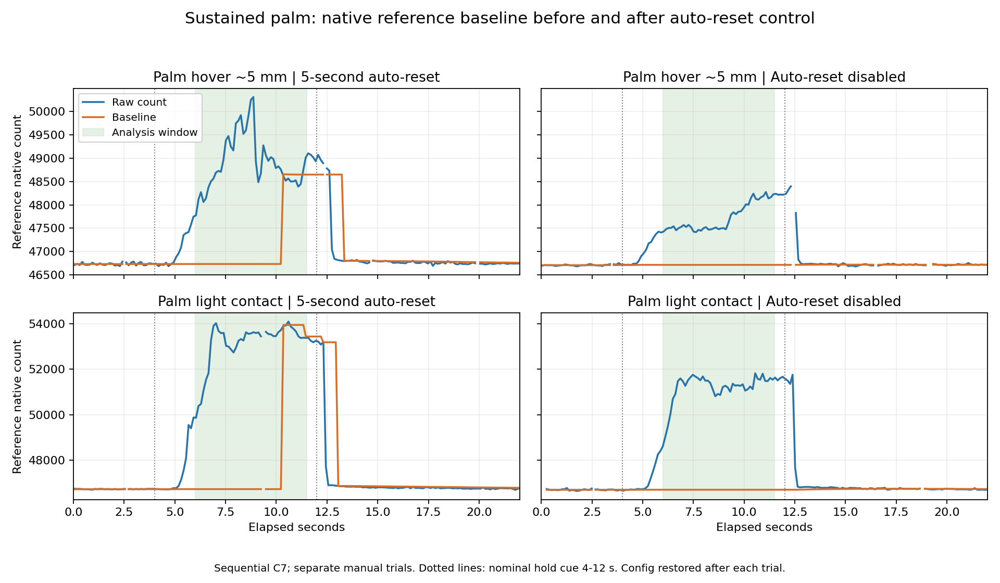

# round89r 自动复位结果与单指对照

2026-10-02。用户已在8772页确认手掌悬空约5 mm、同一区域轻贴两组。0x42 CS0使用16位Proximity、ALP OFF、Proximity自动复位OFF；相对上一轮仅改0x4F的bits7:6及原厂CRC。中心0x40 CS7仍为按钮。两组完成后均恢复原表、重启核对，生产固件仍round89g。

## 基线骤变消失，隔空信号仍在

统一保持窗口6.0–11.5秒，错误整对排除、不填零；顺序C7不是同步扫描。高度从亚克力顶面算，手动估计。

|动作|有效对 / 错误对|中心RAW−BASE|参考RAW−BASE|参考DIFF|参考BASE|
|---|---:|---:|---:|---:|---:|
|手掌悬空约5 mm|45 / 0|85–146|701–1562|537–1197|46715|
|手掌轻贴|44 / 0|226–541|2342–5117|1795–3922|46710|

本次两组整个记录都没有≥500计数的参考基线单步跳变，固定窗口没有DIFF归零。此前两组在约10.35秒的BASE大跳和DIFF坍塌，在关闭5秒Proximity自动复位后均未复现，符合原厂所述机制。这支持自动复位是此前持续信号坍塌的原因，不把一次前后对照当作所有工况的因果证明。

完整`phase_valid`保持阶段各62有效对，BASE跨度都为3计数；仍有4/7行DIFF为零，发生在动作建立阶段。固定稳定窗口和完整接近过程需要区分，不声称从开始靠近第一毫秒即可分类。89对记录不是89次独立触摸。

参考信号仍明显响应悬空；关闭自动复位修正了持续采样的失真，没有验证贴面才触发。手掌参考/中心比值5.712–14.330与8.165–11.944仍重叠，单比值距离公式不成立。参考幅值在这两组手掌中有间隔，但旧食指轻触仅138–212，跨面积单门槛仍不足。

两轮手动姿势、覆盖面积及高度并非严格固定，不能把本轮参考幅值降低归因于关闭ARST或声称灵敏度降低。此轮中心轻贴也更强；对照图只解释基线变化。

## 补齐同配置的单指后再评估工程可行性

继续8772页，保留这两组及全部配置，只补食指轻触、同一食指同一点悬空约3 mm。选择对应动作，沿用第17格附近固定点；每组手先远离30 cm，跟随页面倒计时，恢复后确认。每组仍核对候选、自动恢复、重启回读全部四块。

旧单指在ARST ON配置下采得；即使其参考DIFF没有达到512，也不能假设它与新设置完全等价并直接拼成生产标定。这两组用于得到同配置的跨面积比较，不增加寄存器变量。

后续顺序：先检查同配置四组的中心/参考联合信号及完整动作建立过程，确认是否存在稳定区分；随后评估原生读取覆盖32格和游戏时序的成本。若仅稳定窗口可分或轻触与悬空重叠，则停止从该单邻格参考推导严格距离门控，保留为诊断。若局部可分，也须先通过读取与延迟可行性评估，才值得扩大动作采样。

当前每片仅CS0/CS1能配置Proximity，三个芯片的六个原生参考不能当作32格逐格RAW。当前C7有选传感器、扫描等待和顺序事务成本，不放入实时游戏循环。尚无全板距离控制或零接触误触率结果，继续遵守仅固件/已有寄存器的约束。

## 恢复和留档

两组采前备份及重启后全部四块逐字节与原备份相等2/2，RAW=0、32格零，仍BID round89g。8772服务在分析前正常关闭、串口释放；再次启动仅待用户下一组，不会提前应用候选。

CSV独立核对差值算术、窗口有效数、五字段极值及基线变化通过。41文件证据包逐文件SHA-256核对通过，含本轮原始行、备份/重启回读、前轮手掌对照、图和复现脚本。见[分析JSON](MBR3116_round89r_自动复位实测分析.json)、[证据包](MBR3116_round89r_自动复位实测证据包.zip)。图已检查，无裁切或标签覆盖。

没有固件C++、成品面板或采样事务改动，免迁移、重建和重复Mock。新增主机脚本只离线生成统计与图；元信息核对实际ARST OFF模式。已有5/5字段测试、25/25只读事务复核保持适用。新单指、全板及游戏验收待完成，仅本地提交、不push。
