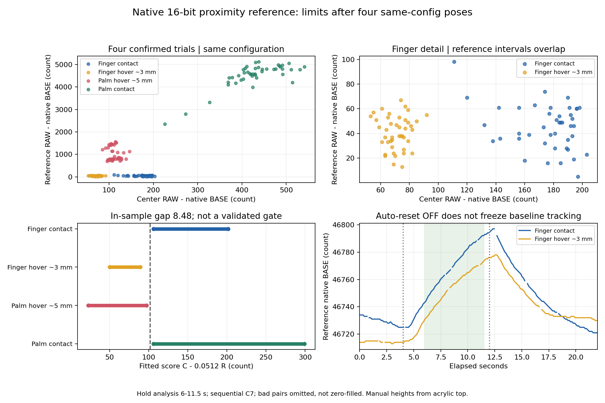

# round89s 同配置结论与现有硬件边界

2026-10-02。四组8772采样均已完成并确认；三颗3116与控制器配置逐组恢复、普通重启回读一致，仍使用用户已确认检测正常的round89g。用户仅接受固件和已有寄存器调整；不改硬件、不推送。

结论：当前原生按钮阈值、单邻格Proximity参考和现有前沿ToF，均未提供足以部署32格低延迟、严格贴面判定的证据。现有Z/F仍是信号标定，不是毫米距离。停止沿这几项变量继续重复相同姿势或直接套用拟合门限；目标尚未实现。此结论不证明所有非线性、时序或限定姿势的抑制算法都不可能。

## 同配置四组结果

参考为0x42 CS0，16位Proximity、ALP OFF、Proximity ARST OFF；中心0x40 CS7保持原按钮配置。仅按原厂定义修改实机读回表的0x26/0x27/0x4F及CRC；0x2E原本已为0。候选SHA-256为`98f66a804c11220f28cf59dcadc0026e4cef618f480cb4116b41af81deff14fc`，不是生产配置。

统一6.0–11.5秒保持窗口，错误整对排除、不补零。C7顺序读取，非同时测量；高度由用户从亚克力顶面手动估计。每种姿势仅一次试验，175有效对不是175次独立触摸。

|动作|有效对 / 错误对|中心RAW−BASE|参考RAW−BASE|参考DIFF|参考BASE|
|---|---:|---:|---:|---:|---:|
|食指轻触|43 / 3|111–203|5–98|0|46744–46792|
|食指悬空约3 mm|43 / 2|53–92|13–67|0|46731–46773|
|手掌悬空约5 mm|45 / 0|85–146|701–1562|537–1197|46715|
|手掌轻贴|44 / 0|226–541|2342–5117|1795–3922|46710|

单指参考区间重叠，旧不同配置单指的参考幅值间隔没有复现。中心这次单指有19计数间隔，但手掌悬空85–146又进入食指轻触111–203范围。单标量或参考/中心比值仍不能给出跨面积的统一距离公式。

关闭Proximity自动复位后，单指参考BASE在固定窗口仍分别变化48/42计数，参考DIFF持续为0；这与小信号进入正常基线跟踪的现象一致。ARST OFF不等于冻结基线，也不能把DIFF为零当成没有电容响应。两组手掌未复现此前大幅基线骤变，保留round89r的机制判断。

四组窗口中未发现中心/参考联合RAW增量的完全相同异类点，不据区间投影重叠宣布所有二维分类无解。最近单指点对为轻触(120,69)、悬空(92,55)，但缺少独立重复和其他位置。

## 固定基线与联合拟合仍不足部署

离线试算`S=C−αR`，α在0–1内以0.0001步长搜索，最大化接触最低分与悬空最高分的间隔。它只是对本次四组数据的拟合，不是原厂距离模型。

|方案|最佳α|接触最低分|悬空最高分|拟合间隔|
|---|---:|---:|---:|---:|
|各帧RAW−原生BASE|0.0512|105.9824|97.5008|8.4816|
|各帧RAW−该组空闲RAW中位数|0.0515|104.7428|97.7743|6.9685|

同一原生分数组合的短空闲窗口峰峰变化为8.46–11.77计数。间隔与其同量级，不能据此建立所有环境下的安全裕量；空闲波动也不是严格误差界或误判概率。固定空闲基线没有解决此次问题，还需要可靠空闲识别、温漂与复位尺度管理。

仅用其他三种姿势拟合，再检查留出的姿势时，原生组合出现食指轻触26/43对被拒、手掌悬空35/45对被放行、手掌轻贴2/44对被拒。固定基线组合分别为27/43、36/45、8/44。它们是姿势留出压力检查，不能当独立游戏误判率，但足以反对把四组拟合常数直接部署。食指悬空留出未错也不构成通用验证。

## 原生接口限制及旧方案修订

|路线|已确认的限制|当前裁决|
|---|---|---|
|ATH OFF、按钮Sensitivity、FT/HYS|按钮已是400 fF最低灵敏度、FT=200合法上限；此前ATH OFF后无接触手掌仍DIFF255并置BUTTON_STAT。ATH只关闭自动阈值，不关闭全部SmartSense调谐|不继续提高至非法FT或把去抖当距离控制|
|普通DIFF空间分类|round89h中轻触/悬空有7种相同非零32格向量，包括仅第17格255|相同瞬时输入无法支持严格接触保证；时间特征仍未验证|
|全板按钮RAW|每片仅一个SENSOR_ID调试窗口，切换后原厂要求等待实际刷新间隔|不能用32次C7放进游戏循环|
|Proximity邻格参考|仅每片CS0/CS1可启用，三片最多6格；单邻格四姿势尚无可靠泛化|保留诊断，不用一个参考给整板开总门|
|16位、ALP OFF、ARST OFF|更宽输出与持续信号失真改善不等于新的物理接触信息；小信号基线仍跟踪|不将实验配置留在现有8位按钮管线中|
|Driven Shield|需要真实屏蔽电极及连接；无原理图或实物连接证据，原厂也不保证把悬空距离压缩至1–2 mm|在只接受固件/寄存器的约束下不启用未确认的引脚功能|

[MBR TRM Rev. E](https://www.infineon.com/assets/row/public/documents/30/57/infineon-cy8cmbr3xxx-capsense-express-controllers-registers-trm-additionaltechnicalinformation-en.pdf)给出按钮FT31–200、HYS0–31、按钮DIFF0–255及CS0/CS1 Proximity限制。16位寄存器容器不使普通按钮获得未截幅DIFF。详见既有round89d/h/l原文核对，不能沿另一Agent的“ATH OFF即彻底关闭SmartSense”“Shield必压缩距离”推论继续实施。

[原厂Host API](https://www.infineon.com/dgdl/Infineon-CY8CMBR3xxx_Host_APIs-ApplicationNotes-v09_00-EN.zip?fileId=8ac78c8c7cdc391c017d0723702846a2)的`SetDebugDataSensorId`/`ReadSensorDebugData`明确选ID、等刷新、再读一致组及有限重试。[MBR Datasheet](https://www.infineon.com/assets/row/public/documents/30/49/infineon-cy8cmbr3002-cy8cmbr3102-cy8cmbr3106s-cy8cmbr3108-cy8cmbr3110-cy8cmbr3116-datasheet-en.pdf)说明Active刷新取扫描处理总时间与20 ms典型值中的较大者。按20 ms估算每片12个ID轮换为约240 ms；这不是实测值，扫描更长则更慢。跨三片并行也不能消除同片多指排队。当前C7每次40 ms等待，32次光等待即1.28秒，更不能用于实时全板门控。

400 kHz下单片读35字节DIFF一致组，仅地址/指针/数据ACK就需342个SCL周期，约855 μs；三片约2.565 ms，未含软件、START/STOP、拉伸及重试。选ID再读13字节调试组约427.5 μs/片的线时之外，仍有原厂刷新等待。优化USB回复或缩短I2C事务不能创造更快的新RAW样本。在线round89g完成帧修复已由用户确认；不把主机吞吐或约200 Hz软件扫描当原生电极刷新。

## 现有Air ToF不能补齐中央贴面证据

用户确认ToF朝上、位于靠近操作者的前沿，窗口约低于亚克力顶面4 mm，中央固定触点到最近窗口水平约45–50 mm。固件hwVer2使用5颗VL53L0X，6个Air键是虚拟高度带，不是6颗测距芯片。

[ST VL53L0X Datasheet DS11555 Rev.6 §6.1](https://www.st.com/resource/en/datasheet/vl53l0x.pdf)给出25°系统视场。用名义圆锥估算`r=(4+h)tan(12.5°)`，h为距亚克力顶面的高度：

|h|0 mm|3 mm|5 mm|10 mm|
|---|---:|---:|---:|---:|
|名义覆盖半径r|0.89 mm|1.55 mm|2.00 mm|3.10 mm|

这些半径远小于45–50 mm偏移。一个位于固定触点正上方的点，要到板面上方约199–222 mm才进入该名义圆锥。它是基于用户粗估和名义视场的几何推论，不是光学实测，也不把视场边界当绝对截止；足以否定将中央指尖0–10 mm直接当成前沿ToF测距对象的假设。手掌或其他手指可进入前沿光束，但无法据此确定中央某一格是否接触；没有有效回波同样不等于已接触。

Air按键还含Kalman预测、10 ms保持，触摸状态参与接近预测的使能判断。反向用派生Air键决定触摸会引入依赖，并可能误拒音游的触摸+Air动作。若以后研究限定场景辅助，必须从新鲜、有效、可关联到目标的原始测距出发，而不能全局否决所有触摸。

代码目前两次调用`setMeasurementTimingBudget(12000)`并忽略返回；当前自研函数按子步骤预算判断成功，没有显式20 ms下限，不能仅据注释声称12 ms一定被拒或已经生效。异步读取检查ready并读距离，没有暴露完整原厂RangeStatus及每样本新鲜度。ST表14的高速示例为20 ms，文档也没有保证此安装结构下0/3/5 mm的接触精度。无需为已缺乏覆盖的中央距离路线修改ToF驱动；预算和有效性问题留作独立Air遵循性核查。

## 后续范围与停止条件

1. 保留round89g和原三片表，采样器关闭、串口释放。没有足够可分信息时，不牺牲刷新率或轻触可用性去宣布“零悬空”。
2. 现有Z/F、ON/OFF可用于信号阈值与条件性误触抑制；面板继续准确标为信号值。用户指定的禁止高度和满触发高度若信号重叠，应报告不能成立的标定，不能硬写两个端点或换算毫米。
3. 只接受固件/已有寄存器时，下一阶段若继续，目标应是限定手势的误触降低。先在已有完整过渡/全板记录上验证时序或空间假设；必须识别正常多押、滑动和触摸+Air的反例，不能只对稳态手掌调参。
4. 新算法必须给出在现有原生运行接口上可获得的输入、独立复测裕量和不增加长确认等待的实现，再安排用户配合游戏动作。未满足这些条件前，不再要求重复本轮四种静态姿势，不启动新的采样或NVM实验。
5. 若验收仍是所有位置/手势严格贴面且完全无悬空，现有方案不能承诺；可靠独立接触证据通常涉及传感/结构改动，但不在当前用户接受范围内，不实施。保留目标为未解决，避免将条件性改善写成根治。

## 验证和留档

四组原始JSON/CSV、候选字段定义、原始配置、重启快照、分析脚本和当前UF2均入[65文件证据包](MBR3116_round89s_同配置四组证据包.zip)，逐文件SHA-256核对通过。两通道差值算术、三个固定窗口有效/错误数及八字段极值独立核对通过；4/4组重启后的四块配置等于采前备份，RAW=0、32格零。完整统计、拟合搜索和几何计算见[分析JSON](MBR3116_round89s_联合信号与可行性分析.json)。图已检查，没有裁切或标签覆盖。

UF2仍186880字节，SHA-256为`AA4A65DBBF98CCB809142BB765D8ACE786A489BAA742EDC8AA32DC25DAEFC941`；这是已存固件及各组重启版本核对，不冒称本轮重新刷写或重新游戏验收。本轮未操作设备、未改固件C++、成品面板或采样事务，仅离线分析/文档/证据，免迁移、构建和重复Mock。只提交本地Git，不push。
