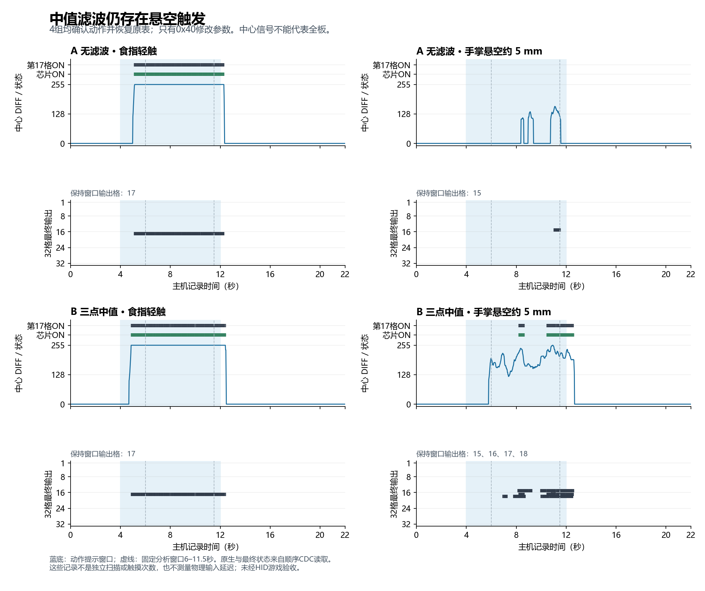

# round89w 提交复核与原生滤波对照

2026-10-02。排除 ToF 联合校准，继续按 3116 原生接口研究条件性隔空抑制。

## fa64229 复核

采用反向提交保留历史，撤销 fa64229 的面板与效果声明，再从 23e286f 的源文件补齐安全设置。该提交仅改变面板与日志，未改变 RP2040 固件；设备仍为 round89g。

|问题|证据与影响|
|---|---|
|缺少效果验收|30 帧静置全零只证明静置状态，不能证明悬空/接触区分或游戏可用。推荐 FT160/H16 的 ON=176，强档 FT180/H20 的 ON=200，均低于已实测的悬空255。|
|模板补齐后整表刷写|`mbrBurnAll`、`applyMbrPreset`可为未读取的芯片填内置表，覆盖原引脚/扫描及无关字段。|
|校验未进入写路径|`mbrValidateTable`仅定义，无调用；实际 `mbrBurnOne`仍强改地址并发送整表。|
|错误的“出厂”|预设 Sensitivity=0（100 fF）、CFG2=0x58（按钮5秒复位），不同于各片内置模板400 fF、去抖1、CFG2=0x68（按钮20秒）。|
|重复按钮|成品4149/4152两处`mbrRegClose`、4150/4153两处`btnMbrRegWrite`，另有多余闭合标签；第二套控件没有正常事件/启用路径。|

这些行号对应 fa64229 的归档成品，不是后续编辑的行号。复核由另一只读代理交叉确认。

审查时新读设备三片均 FT180、HYS20、去抖2、NT/NNT80/LBR50覆盖、ATH OFF，与提交日志声称的FT160不同；不把该差异归因为任何未核实的用户动作。先保存该状态，再恢复本轮初始三片表。三片128/128回读及普通重启一致，控制器配置保留审查时的现值，未回退其他调节。

备份：工作区`_dev_archive/round89v_review_before_20261002`保留提交成品、源文件与patch；`round89v_device_readonly_20261002`保存审查时设备快照；`round89u_before_20261002_034834`保存原源码、面板及round89g UF2。实际运行UF2 SHA-256为`AA4A65DBBF98CCB809142BB765D8ACE786A489BAA742EDC8AA32DC25DAEFC941`；普通`build/Nyanithm.uf2`是更旧产物，另存，未误用来刷机。

## 新的单变量候选

从真实0x40表局部修改，保持400 fF、FT200、去抖1、地址、电极映射、NT/NNT/LBR自动及原ARST。0x41/42不改。

|组|修改字段（另更新原厂CRC）|用途|
|---|---|---|
|A|0x4F仅清ATH bit3|手动FT200、无滤波对照|
|B|A + 0x4D bit0|三点中值，测试短尖峰与快点代价|
|C|A + 0x4D bit1|IIR，测试高频噪声与释放残留|
|D|A + 0x1D=0x9F|HYS31，ON231/OFF169，检查弱误触及抬手残留|

依据：[原厂TRM Rev.E §1.5.25/26/58/60](https://www.infineon.com/assets/row/public/documents/30/57/infineon-cy8cmbr3xxx-capsense-express-controllers-registers-trm-additionaltechnicalinformation-en.pdf)、[AN90071 §5.1.1.6、§6.2.1](https://assets.infineon.com/is/content/infineon/infineon/row/public/documents/30/42/infineon-an90071-cy8cmbr3xxx-capsenser-design-guide-applicationnotes-en.pdf)。Median/IIR分别抑制尖峰/高频噪声，不提供距离测量，不拒绝稳态255。原厂不建议无依据覆盖NT/NNT/LBR，不将这些字段混入预设。

每组从新读备份开始，0xBA保存/复位/128B回读后，通过配置模式B9重启进入普通模式，C5=2、B1(33B)与C0(46B)顺序采样；结束重新进入配置模式恢复0x40，核对全部三片及controller_config，再通过B9普通重启回读。短读/坏帧立即终止，恢复未确认则锁定后续实验。

B1和C0不同时读取；C0会在seqlock超时使用缓存，数据没有独立原生扫描编号。因此采样行数不是独立触摸次数，命令耗时不是触摸延迟。CDC最终状态也不能替代实际HID游戏验收。

## 流程预检

已在无手势状态跑完A候选写入、普通模式22秒采样、恢复及重启核对：1074记录，无读错误；三片与控制器配置恢复一致、RAW=0。该组标为`preflight`且不计入效果数据。初版采样器误在配置模式使用C0/B1，预检识别后已停止并修正，没有将其错误记录当触摸证据。

手势对照由8773自助页面控制动作与确认，先A/B各做轻触、手掌5mm悬空，再根据结果决定是否扩展C/D及快点/多押/slide。未经用户确认的动作或恢复失败组排除。未找到有独立裕量并通过游戏验收的组合前，不将候选留作生产NVRAM，也不称为稳定解决。

## 四组结果

四组均完成、用户确认动作正确、恢复后普通重启核对一致。以下固定窗口为6–11.5秒，每组约269条主机观察记录。

|配置/动作|中心DIFF|中心原生ON / 最终ON记录|完整32格最终输出|
|---|---|---|---|
|A轻触|255|269 / 262|第17格|
|A手掌5mm悬空|0–160|0 / 0|第15格23条|
|B轻触|255|268 / 257|第17格|
|B手掌5mm悬空|120–255|75 / 74|第15/16/17/18格，任意格ON168条|

A中心没有误触，但0x40 CS8仍有原生触发并产生第15格输出，不能仅看中心就判成功。B悬空中心已有255，与轻触重叠；三片原生触发涉及0x40 CS7/8、0x41 CS7、0x42 CS0。因此B不能作为稳定的接触判定方案。只改变0x40，手掌摆位及未改参数的相邻芯片仍是影响因素；各姿势仅一次，不用记录数量宣称B改善或恶化百分比。

`slider`是C0的32格最终状态，只含0/128；本次仅保留中心B1 DIFF，未保存完整32格DIFF。轻触窗口另有A7条、B11条“中心DIFF255、原生ON、最终OFF”；缺少失败遥测且两命令顺序读取，不能定位断触原因、归因于滤波或计算物理时长。

四组基线(.25–3.5秒)及移开后(14–21.5秒)全部原生/最终为零。三片NVRAM与controller_config的逐组备份、恢复后重启文件独立比较，4/4一致。1074条静置预检继续排除。原始记录、恢复文件、固定窗口分析及绘图脚本在本轮证据包。

用户要求休息后暂停配合测试，8773已关闭，C/D未进行手势试验。后续先做D或C的悬空反例；出现任意格误触即停止该档。只有悬空通过后才补同档轻触、3mm食指悬空、快点、slide、双押及HID游戏验收。当前未找到稳定解决配置，保持原始NVRAM；固件仍round89g。

## 面板改进

面板1.1.1-beta9，源文件与release同步，仅维护hw_v1。

- 详细设置按常用参数、逐通道参数、只读硬件/基线分组；开放0x4D中值/IIR、0x4F ATH单bit、0x1D迟滞、按下消抖1–15、已使能通道FT31–200和灵敏度。同步修改需先读齐。
- 以真实C6回读作为可信基底；模板仅查看，导入及全部写入口遵循同一安全位掩码。保护地址、引脚、NT/NNT/LBR、ARST及未使能通道。
- 写前重新读取并逐字节比对原表，保存完整备份；无变化跳过；0xBA命令/载荷分开写，纯等待完成；随后核对128字节。批量预校验所有目标、首错停止；NVRAM失败阻止联动CFG_SET与重启。
- 切换芯片保留草稿；重新读取/查看模板先确认丢弃；备份可下载；断线清可信基底。新写路径要求完整合法BID且≥round88d。
- 删除无实测依据的“抗悬空/出厂”预设及效果宣传；修正SPO_CFG(0x4C)、REFRESH_CTRL(0x52)、STATE_TIMEOUT(0x55)说明。标题/按钮直接表达操作，新增注释精简。

## 验证与边界

- release：1.359 MB，9812行，devDiag=0，单个main/body；JS syntax与diff空白检查通过。
- 参数与交互46/46：安全掩码、CRC、外部原表变更、备份、全表回读失败、首错停止/阻止保存、未读禁写、旧固件门禁、无重复ID与390px弹窗。
- 严格BID门禁27/27；既有保存/重连/输入/灯光/旧固件/gen2 Mock23/23。
- 真机Web Serial16项：新写流程应用B候选及恢复，均128/128；保存重启自动重连；配置128字节不变；0xCE读成功；CFG_SET保持独立1B+128B双写。随后独立快照确认三片/配置一致、RAW=0。此回归先于最终3行畸形BID门禁及版本标记收尾；收尾未改写入/保存实现，合法BID路径另经纯校验。设备重枚举的断开日志及Electron开发环境CSP提示另列，不误当无异常。
- 触摸迁移138/138通过；没有C++、协议结构、SDK或UF2变更，免固件重编译。未跑游戏验收、UF2全自动刷机；全页原有390px输入测试区域横向溢出未扩修，本轮NVRAM弹窗无横向溢出。
- 最终写/保存路径经独立只读代理复核；文档和工具输出一致。源码、原始手势数据、回归记录与分析打包到`MBR3116_round89w_面板与原生滤波证据包.zip`，内置逐文件SHA-256清单。仅本地提交，不推送。
