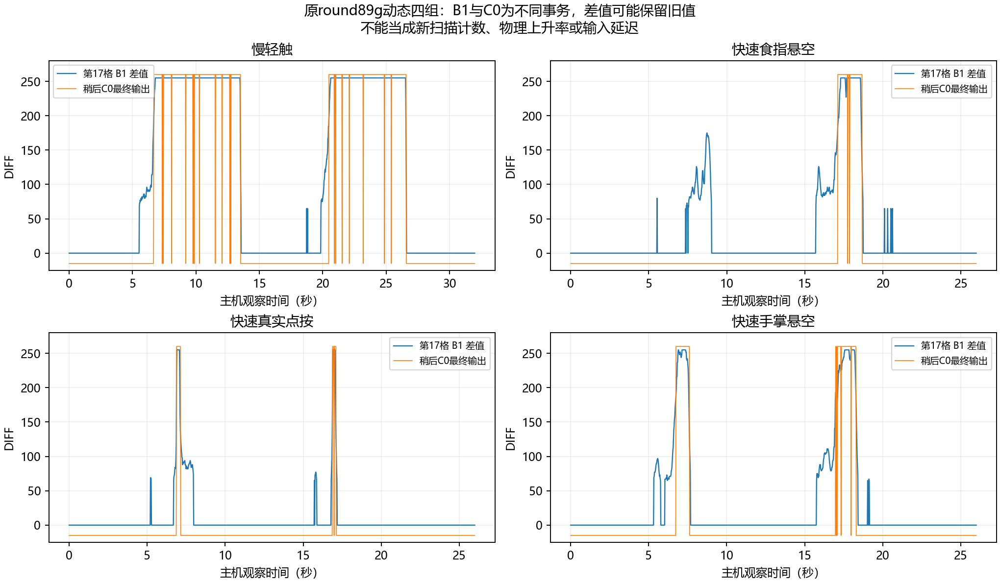
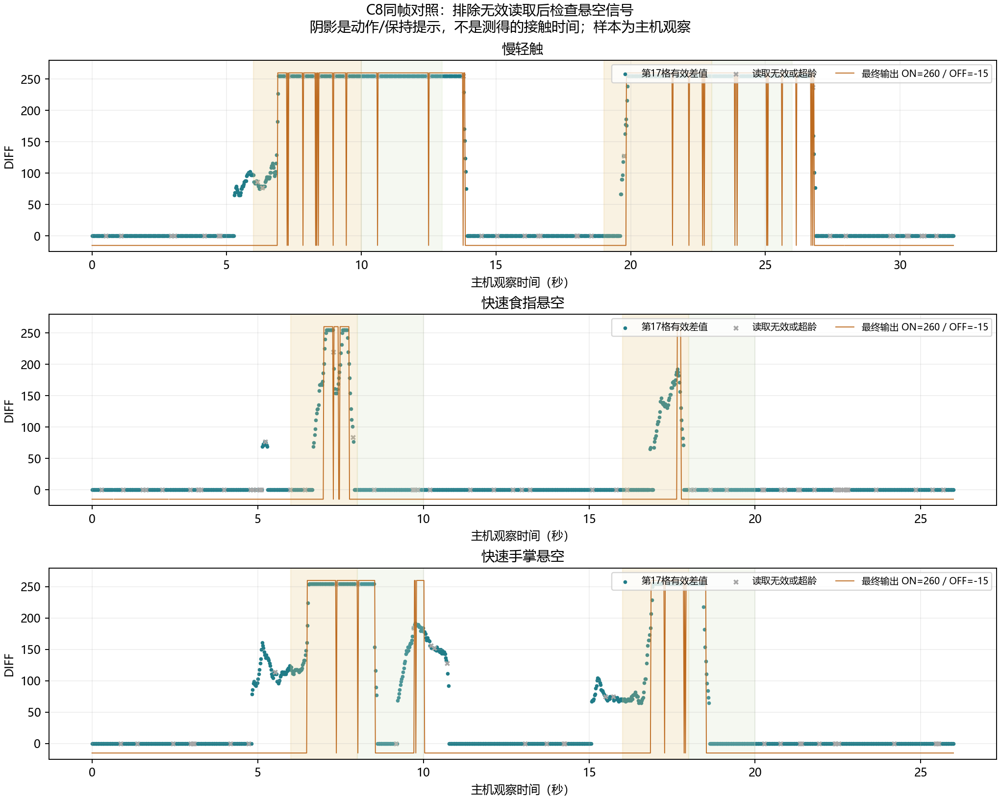

# round89x：动态实测与同帧诊断

2026-10-02。设备：5303284739002C9C、HW:v2、三片MBR3116；只维护hw_v1，不使用ToF。

## 结论

尚未找到稳定拒绝悬空且保留轻触的生产配置。D档最大原生迟滞仍产生第15–19格悬空输出，已恢复原配置。动态四组表明，“只有快速上升才触发”不能兼顾本轮慢轻触和快速悬空，暂不部署该规则。

按钮DIFF达到255不等于原始ADC饱和，也不能换算成毫米。单靠平行板公式不能确定真实电极/人体耦合。空间尖峰、快速边沿及接地网格都需验证，不支持“极高可靠性”“100%根治”的保证。

## 原固件动态四组

round89g、相同真实NVRAM基底、第17格中心、每组两次动作、用户逐组确认，均恢复RAW=0。悬空高度从亚克力顶面估计。仅纳入完成且确认的四组；三组中止/作废记录仍保存在证据包。

| 动作 | 主机观察数 | 中心DIFF峰值 | 中心最终ON观察数 | 最终出现ON的格 |
|---|---:|---:|---:|---|
| 慢轻触 | 1573 | 255 | 618 | 17 |
| 快速食指悬空约3 mm | 1278 | 255 | 75 | 17 |
| 快速真实点按 | 1278 | 255 | 24 | 17 |
| 快速手掌悬空约5 mm | 1279 | 255 | 103 | 15、17、18、19 |

约100 ms主机观察窗口最大正增量折算依次97.07、108.58、213.96、96.12 count/100 ms。这不是物理dC/dt或输入延迟。B1、C0、C1是依次执行的独立事务；压力可能保留旧好值，全局失败计数安静不证明每格新鲜。提示时刻不是实际触板时刻，快速点按阶段也含下探和抬起。

这里只否定本轮直接用最小上升速度区分慢轻触/快速悬空的门限，不证明所有时间算法无效。

## D档原生迟滞

仅修改真实0x40基底的ATH与迟滞覆盖，重新计算官方CRC；FT200、400 fF及其他字段保持。实际差异偏移0x1D、0x4F、0x7E、0x7F。选择ATH OFF、HYS31，原厂BUTTON_HYS合法范围0–31。

用户确认手掌悬空约5 mm、全程未触板。固定6.0–11.5秒窗口268条主机观察，中心DIFF131–255；中心最终ON232条，任意格ON267条，输出覆盖第15–19格。它们不是独立触摸次数，不作为同姿势A/B改善率。

候选写入及128B回读通过。随后恢复并重启，独立核对三片128B与控制器128B逐字节一致，首次恢复成功。D档不留在设备，不追加其轻触组来认证一个已被悬空反例否定的稳定方案。

## 同帧诊断固件

新增共享命令0xC8，返回完成帧的32格16位DIFF、原生BUTTON_STAT、软件验证位、最终输出及逐片读取质量。复用已启用PROFILE门控的读数；没有新增I2C事务、重试、等待或触摸规则。额外快照复制有少量CPU成本，仍需HID游戏手感验收。

原B1/C0/C1长度、HID布局、保存/NVRAM写入及控制面板保持。新命令只定义在共享头。原driver仍最多两次SYNC尝试，底层generic/NACK重试次数保持。

源码和实际round89g UF2备份在`_dev_archive/round89x_before_20261002`；真实参数基底在`round89x_dynamics_before_20261002_165335`，刷前另备份`round89x_flash_before_20261002`。

已刷1.6.6-beta5 / BID=round89x。UF2 190464B，SHA-256 `8E23B5D1A568BFB15AC34CB1DA0F285F06495A5612C5A93E5DE1A82C3238A301`。刷后版本签名、控制器配置及三片NVRAM逐字节比对通过，RAW=0。

预检150帧，0x40/41/42分别146/145/146帧满足成功读取与主机年龄条件；I2C最终失败增量均0，SYNC不匹配增量分别56/44/42。预检姿势未受控，不当作无触碰验收。

新页面三组已完成且用户确认。只纳入这三组；另两组中止、一组作废均保留并排除分析。

| C8动作 | 总帧 | 中心有效帧 | 32格全有效帧 | 中心有效DIFF峰值 | 中心有效最终ON帧 |
|---|---:|---:|---:|---:|---:|
| 慢轻触 | 1573 | 1522 | 1466 | 255 | 662 |
| 快速食指悬空 | 1278 | 1220 | 1163 | 255 | 41 |
| 快速手掌悬空 | 1278 | 1241 | 1161 | 255 | 192 |

有效条件为PROFILE、有保留的一致好数据、最近尝试成功、主机读龄≤15ms、对应电极rangeMask有效、BUTTON_STAT成功。快照复制失败帧分别1/2/0，直接排除其零值；不把失败帧当信号下降。

**单帧空间反例**：慢轻触保持阶段内部10.5202秒/frame151072，与食指悬空动作7.0773秒/frame163333，有完全相同的32格16位向量：只有第17格255，其余0。两帧hardware/verified都为`800000000000`，最终只第17格ON；三片读龄分别3/2/1ms及4/3/2ms，均有效。它不是保留旧值或读取失败假象。任何只依据当前DIFF向量、突出度或曲率的确定规则，都会对这对接触/悬空样本做相同判定。这不否定使用额外独立信号或完整历史的算法。

**时间反例**：慢轻触第二次动作的有效观察最大正增量约95.21 count/100ms，食指悬空第一次约109.51，手掌第一次约111.10。直接设最小上升门限来拒绝这两次悬空，会漏掉这次慢轻触。第一次慢轻触约147.82，说明不能只挑最快接触作为轻触代表。这些仍是主机观察轨迹，非物理dC/dt。

**短暂断开线索**：慢轻触两段保持窗口各147个成功复制帧，最终OFF分别2/5帧；这7帧均为最近DIFF读取失败，同时native仍ON、保留DIFF255。有效中心帧的保持输出287/287为ON。当前门控失败即清零会造成此类中断，应另行研究原生一致读取与时序；读取质量修复本身不能区分上述有效悬空信号。

全部三组最终I2C失败增量均0，仍有SYNC不匹配；单片SYNC增量见原始分析JSON。采后独立回读三片NVRAM及控制器与刷前备份一致，RAW=0、33B输入全零，串口及本地采样服务关闭。未做HID游戏验收。

## C8协议

普通命令模式发送C8。正常240B；TX空间不足可回1B `00` BUSY，完全无空间可能无回复。主机必须处理BUSY/超时，结束当前事务再重试；短帧后不得继续混发命令。

| 偏移 | 内容 |
|---:|---|
| 0–3 | tag=C8、version=1、chipCount、reportFlags |
| 4–11 | frameId、publishedMs，LE uint32 |
| 12–75 | counts[32]，LE uint16，保留超255值 |
| 76–107 | slider[32]，0/128 |
| 108–119 | hardware[3]、verified[3]，LE uint16 |
| 120–239 | 三项40B MbrTraceChip，具体布局见共享头 |

reportFlags为PROFILE=1、COPY_FAILED=0x80。最多3次seqlock尝试；失败返回明确失败帧，不以旧帧冒充新帧。

chip flags：ATTEMPTED=1、VALID=2、HAS_GOOD=4、COHERENT=8、BUTTON_VALID=0x10、READ_THIS_FRAME=0x20。VALID只表示最近读取尝试成功；COHERENT、SYNC、rangeMask与goodStart/End描述保留的好counts，失败保留原成功时间并清VALID。主机另核对主机年龄≤15ms、电极rangeMask及BUTTON_VALID。计数随profile/layout重置，不是全启动期累计。

PROFILE关闭时没有差值采样来源，零值不当空闲测量，即使legacy RAW路径另读压力。芯片顺序读取，BUTTON_STAT与DIFF也来自不同原生事务。同帧不意味同时采样；时间为主机读取界限，SYNC为一致性校验，不是新物理扫描ID。

## 验证与后续

- 迁移前后138/138；生产driver编译测试19/19；生产publisher/readers 28/28，包括复制失败、并发、TX不足/全满。
- 实际生产管线34/34、66711断言；覆盖v1/v2/MPR、旧值保留、SYNC失败、BUTTON_STAT失败、超255和关闭门控。
- SDK2.2.0构建通过。首轮漏`<cstring>`编译失败，补齐并重新构建后刷写确定哈希产物。
- 独立只读审查无阻断项，已补齐元数据、计数重置、无回复语义。主机解析校验通过；页面1280×900、390×844无异常，先前Mock确认锁/中止/恢复通过。
- 成品面板和保存路径未变，豁免重复面板保存回归；配置保持由真机刷前后快照确认。未经HID游戏内轻点、多押、滑动及延迟验收。

先检查有效DIFF空间重叠、观察轨迹和读取失败相关性，再决定实验门控。候选须保留慢轻触、快点、滑动、宽按、多押，并由独立组检验。排除宽手掌不能代替处理单指悬空。

若有效信号仍无稳定分界，优先做局部电极面积/接地布局小样，寻找悬空峰值与最弱轻触之间的余量，再决定全板改造。精确接触可评估支持静态接触的独立力/位移确认层。更换电容芯片只增加可调能力，不保证凭单幅值识别接触。当前未实施硬件改造，也未承诺固定2–3 mm截止距离。

依据：[Infineon CY8CMBR3xxx Registers TRM](https://www.infineon.com/assets/row/public/documents/30/57/infineon-cy8cmbr3xxx-capsense-express-controllers-registers-trm-additionaltechnicalinformation-en.pdf)，BUTTON_HYS、DEVICE_CFG2、SYNC_COUNTER及DIFF章节。原始CSV/JSON、脚本、备份、UF2及测试源片段哈希见`MBR3116_round89x_动态与诊断证据包.zip`；逐文件SHA-256见证据核对JSON及ZIP内清单。
